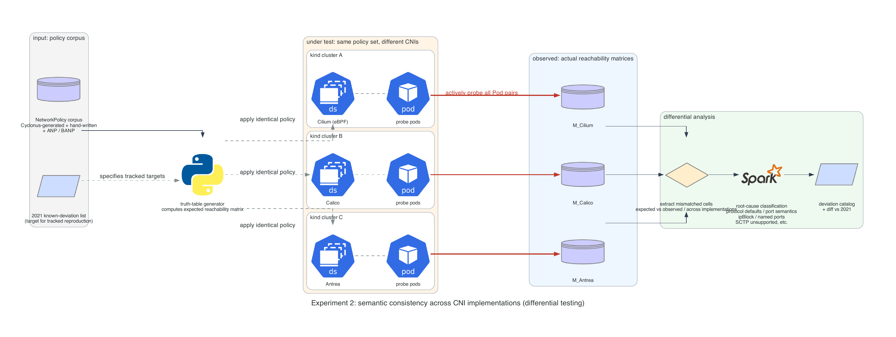

# netpol-window

A measurement harness for the unprotected window between a Kubernetes Pod
becoming Ready and its NetworkPolicy actually being enforced by the CNI.

```
window = t_blocked - t_ready
```

Kubernetes' own docs acknowledge that a Pod "may be started unprotected"
before NetworkPolicy handling completes. This project measures how large
that window actually is, across CNI implementations, under Pod churn.

## Quick start

```bash
task setup      # verify local dependencies
```

Cluster lifecycle and end-to-end smoke-test tasks (`cluster:up`,
`cluster:down`, `smoke`) work across Cilium, Calico and Antrea — pass
`CNI=cilium|calico|antrea` (default `cilium`), e.g. `task cluster:up CNI=calico`.

## Architecture

Two experiments make up the harness. `t_ready` and `t_blocked` are defined
formally in [`docs/methodology.md`](docs/methodology.md); the diagrams below
just show what gets stood up to measure them.

### Experiment 1 — unprotected-window measurement (primary)


Measures the single quantity `window = t_blocked - t_ready` for each Pod
under churn, across CNI implementations.

### Experiment 2 — CNI consistency (secondary)



Applies the same NetworkPolicy corpus to multiple CNI implementations and
diffs the resulting reachability matrices to classify deviations.

Both diagrams are generated from [`docs/architecture/diagrams/`](docs/architecture/diagrams/)
with [mingrammer/diagrams](https://github.com/mingrammer/diagrams); regenerate
with `python3 exp1_unprotected_window.py` / `python3 exp2_cni_consistency.py`
in that directory (requires `pip install diagrams` and Graphviz).

## Documentation

- [`docs/methodology.md`](docs/methodology.md) — read this first. Defines
  what is actually being measured.
- [`docs/related-work.md`](docs/related-work.md) — literature basis for
  the research gap.
- [`docs/adr/`](docs/adr/) — architecture decisions and their rationale.
- [`AI-USAGE.md`](AI-USAGE.md) — GenAI usage disclosure.

## License

Apache-2.0. See [`LICENSE`](LICENSE).
